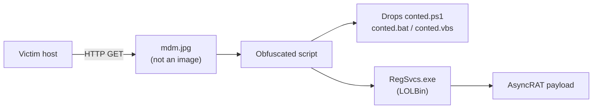
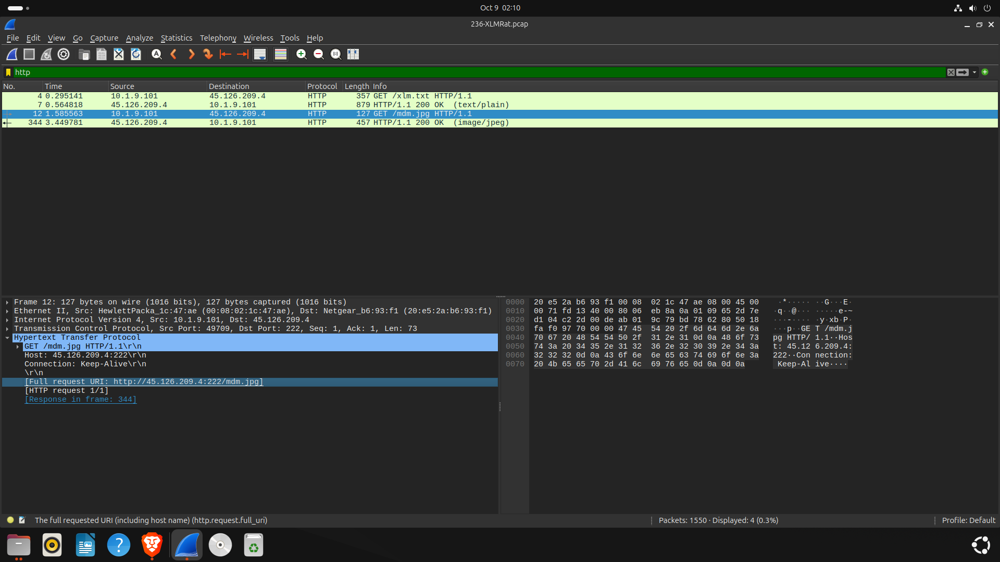
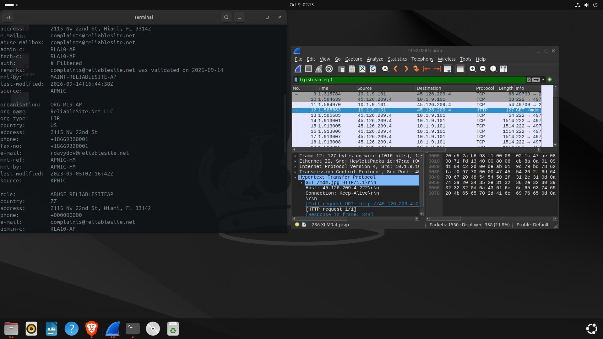
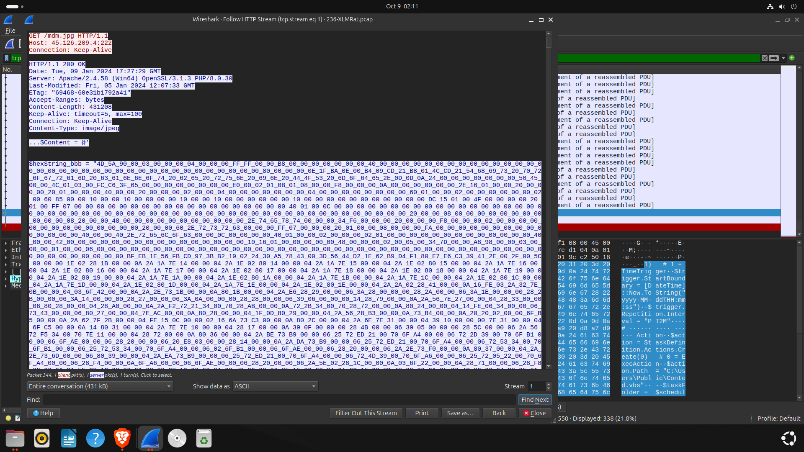
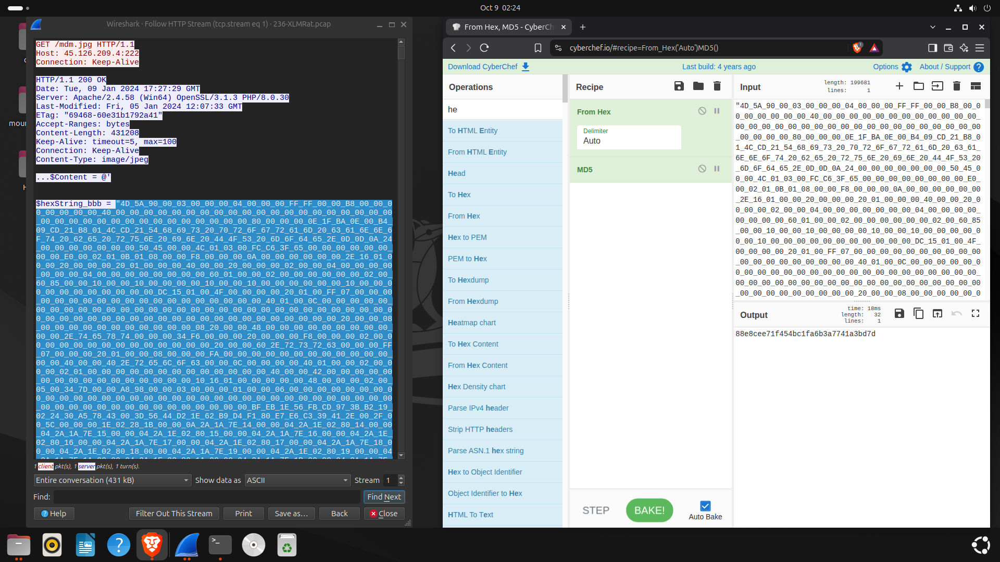
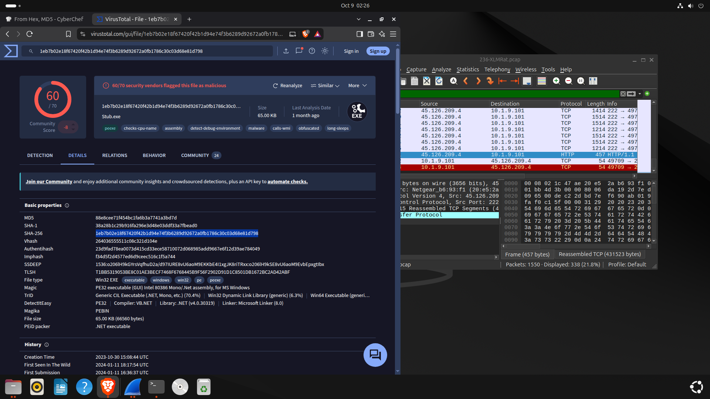
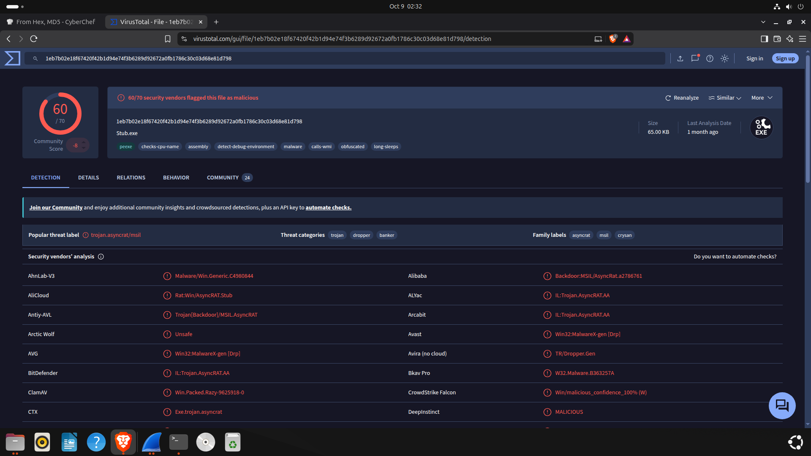
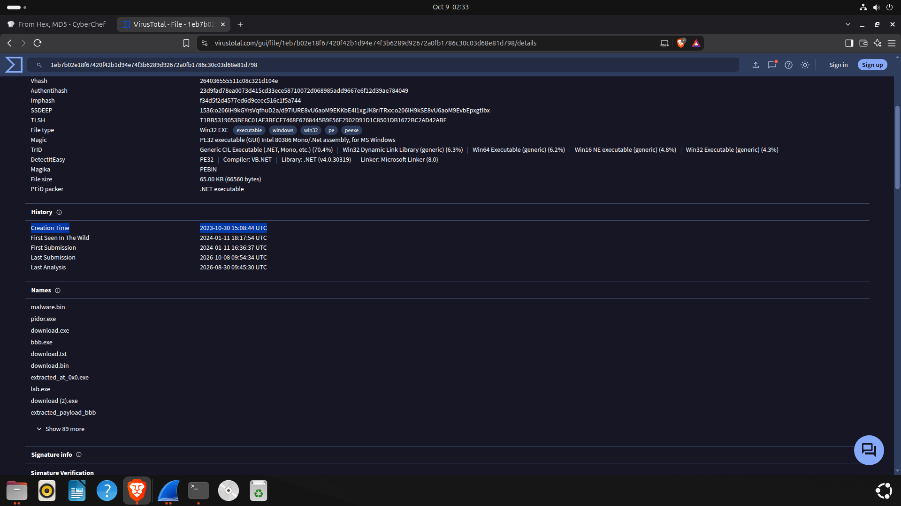

<div align="center">

# 🔎 DFIR Investigation: XLMRat

### Network Forensics & Malware Triage — CyberDefenders Lab


*From a suspicious `.jpg` in a PCAP to a fully identified RAT delivery chain.*

</div>

---

## 📑 Table of Contents

- [Overview](#-overview)
- [Objectives](#-objectives)
- [Tools](#-tools)
- [Methodology](#-methodology)
- [Attack Chain](#-attack-chain)
- [Key Findings](#-key-findings)
- [Indicators of Compromise](#-indicators-of-compromise-iocs)
- [MITRE ATT&CK Mapping](#-mitre-attck-mapping)
- [Detailed Walkthrough](#-detailed-walkthrough)
- [Defensive Takeaways](#-defensive-takeaways)
- [Repository Structure](#-repository-structure)
- [Skills Demonstrated](#-skills-demonstrated)
- [Disclaimer](#-disclaimer)
- [Author](#-author)

---

## 📌 Overview

This project documents the investigation of a malware delivery and execution scenario from the **XLMRat** lab on CyberDefenders.

The analysis covers network traffic inspection, recovery of the first malware stage, payload deobfuscation, hash validation, malware family identification, and the abuse of a Windows **Living-off-the-Land Binary (LOLBin)** for stealthy execution.

| | |
|---|---|
| **Platform** | CyberDefenders |
| **Lab** | XLMRat |
| **Category** | Network Forensics |
| **Investigation type** | Network traffic analysis and malware triage |

---

## 🎯 Objectives

- [x] Identify the URL used to download the first malware stage
- [x] Determine the hosting provider of the attack infrastructure
- [x] Follow HTTP traffic to identify and recover malware artifacts
- [x] Deobfuscate the payload and calculate its SHA256 hash
- [x] Identify the malware family and PE compilation timestamp
- [x] Investigate the LOLBin used for stealthy execution
- [x] Identify files dropped by the malicious script
- [x] Map attacker techniques to MITRE ATT&CK

---

## 🧰 Tools

| Tool | Purpose |
|------|---------|
| **Wireshark** | PCAP inspection, HTTP filtering, TCP stream analysis |
| **CyberChef** | Payload decoding and deobfuscation |
| **VirusTotal** | Hash analysis, malware identification, PE metadata |
| **Python 3** | Artifact parsing and analysis automation |
| **MITRE ATT&CK** | Classification of observed techniques |

---

## 🧭 Methodology

1. Inspect the PCAP and identify HTTP requests originating from the victim
2. Extract the URL used to retrieve the first malware stage
3. Investigate the IP address and hosting provider
4. Follow the relevant HTTP/TCP stream to inspect the downloaded content
5. Deobfuscate the malicious script and identify its payloads
6. Calculate and validate the executable's SHA256 hash
7. Use VirusTotal for malware classification and PE metadata
8. Identify the LOLBin and files referenced by the script
9. Map observed behavior to MITRE ATT&CK

---

## 🔗 Attack Chain



---

## 🏁 Key Findings

| Question | Finding |
|----------|---------|
| First-stage malware URL | `hxxp://45.126.209[.]4:222/mdm.jpg` |
| Hosting provider | reliableSite.net |
| Executable SHA256 | `1eb7b02e18f67420f42b1d94e74f3b6289d92672a0fb1786c30c03d68e81d798` |
| Malware family (Alibaba) | AsyncRAT |
| PE compilation timestamp | 2023-10-30 15:08 |
| LOLBin | `C:\Windows\Microsoft.NET\Framework\v4.0.30319\RegSvcs.exe` |
| Files dropped | `conted.ps1`, `conted.bat`, `conted.vbs` |

---

## 🚩 Indicators of Compromise (IOCs)

> Network indicators are defanged for safety.

| Type | Value |
|------|-------|
| URL | `hxxp://45.126.209[.]4:222/mdm.jpg` |
| IP | `45.126.209[.]4` |
| SHA256 | `1eb7b02e18f67420f42b1d94e74f3b6289d92672a0fb1786c30c03d68e81d798` |
| File | `conted.ps1` |
| File | `conted.bat` |
| File | `conted.vbs` |
| Process | `RegSvcs.exe` (unexpected execution / suspicious arguments) |

---

## 🛡️ MITRE ATT&CK Mapping

| Technique | ID | Relevance |
|-----------|----|-----------|
| Ingress Tool Transfer | `T1105` | Download of a malware stage over HTTP |
| PowerShell | `T1059.001` | Identified PowerShell script and execution context |
| System Binary Proxy Execution: Regsvcs/Regasm | `T1218.009` | Abuse of `RegSvcs.exe` |
| Reflective Code Loading | `T1620` | Lab focus; needs script/behavioral evidence to confirm the exact implementation |

> **Note:** Reflective code loading should be validated against the script or payload behavior, not inferred only from the presence of a LOLBin.

---

## 🔬 Detailed Walkthrough

### 1. Initial Malware Delivery

Filtering HTTP traffic in Wireshark and reviewing GET requests from the victim revealed a download from a remote IP. The file used a `.jpg` extension, but the extension alone does not prove it is an image.



### 2. Hosting Infrastructure

The destination IP `45.126.209.4` is associated with **reliableSite.net**. Hosting association does not imply the provider knowingly participated in the activity.



### 3. HTTP Stream Analysis

Following the TCP stream showed that the resource served as `.jpg` was not a conventional image, reinforcing the need to inspect content rather than trust filenames.



### 4. Script Deobfuscation

CyberChef was used to decode the obfuscated content, identify the executable payload, and obtain its SHA256.



### 5. Hash Validation & Malware Family

The SHA256 was submitted to VirusTotal. The lab identified the family as **AsyncRAT** based on Alibaba's classification.




> In an independent investigation, compare multiple engines and behavioral evidence instead of relying on a single vendor label.

### 6. PE Compilation Timestamp

VirusTotal metadata reports a compilation timestamp of **2023-10-30 15:08**. PE timestamps can be manipulated and may need timezone clarification, so this is not proof of when the malware was created or deployed.



### 7. LOLBin: RegSvcs.exe

`RegSvcs.exe` is a legitimate .NET Framework utility for registering serviced components. Its security significance depends on how it is invoked, its arguments, and whether the activity matches expected administration.

### 8. Dropped Files

| File | Format | Relevance |
|------|--------|-----------|
| `conted.ps1` | PowerShell | Script execution and payload delivery |
| `conted.bat` | Batch | Windows command execution |
| `conted.vbs` | VBScript | Scripting and execution orchestration |

> These are format-based interpretations. Confirming each file's exact role requires inspecting its contents and execution context.

---

## 🧠 Defensive Takeaways

- **Inspect payloads, not filenames.** A `.jpg` extension does not guarantee image data.
- **Correlate network and host artifacts.** Requests, files, scripts, and PE metadata tell a fuller story together.
- **Monitor LOLBin usage.** Watch for unexpected `RegSvcs.exe` execution, unusual arguments, and suspicious parent-child process relationships.
- **Track artifacts by hash.** SHA256 enables consistent correlation across tools and threat intel.
- **Treat attribution as evidence-based.** Vendor labels are indicators, so corroborate them.
- **Preserve the investigation trail.** Screenshots, artifacts, timestamps, and conclusions improve reproducibility.

---

## 📂 Repository Structure

```text
.
├── README.md
├── report/
│   └── XLMRat-DFIR-Report.pdf
└── screenshots/
    ├── q1-http-request.png
    ├── q2-hosting-provider.png
    ├── tcp-stream-analysis.png
    ├── cyberchef-decoded-sha256.png
    ├── virustotal-sha256.png
    ├── virustotal-asyncrat-family.png
    └── virustotal-pe-timestamp.png
```

---

## 💡 Skills Demonstrated

`PCAP Analysis` · `HTTP Stream Inspection` · `Script Deobfuscation` · `Malware Triage` · `Hash-based Investigation` · `LOLBin Detection` · `IOC Extraction` · `MITRE ATT&CK Mapping` · `DFIR Reporting`

---

## ⚠️ Disclaimer

This report documents findings from an **authorized training lab** and is intended for educational and defensive purposes. IPs, filenames, hashes, and indicators are included for analysis only and should not be read as attribution to any individual or organization.

---

## 👤 Author

**Daniel Widal**
DFIR · Network Forensics · Malware Analysis · Blue Team

🔗 Lab reference: [CyberDefenders — XLMRat](https://cyberdefenders.org/)
