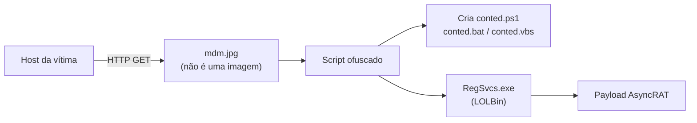

<div align="center">

# 🔎 Investigação DFIR: XLMRat

### Forense de Rede e Triagem de Malware — Lab da CyberDefenders


*De um `.jpg` suspeito em um PCAP até uma cadeia de entrega de RAT totalmente identificada.*

</div>

---

## 📑 Sumário

- [Visão Geral](#-visão-geral)
- [Objetivos](#-objetivos)
- [Ferramentas](#-ferramentas)
- [Metodologia](#-metodologia)
- [Cadeia de Ataque](#-cadeia-de-ataque)
- [Principais Achados](#-principais-achados)
- [Indicadores de Comprometimento](#-indicadores-de-comprometimento-iocs)
- [Mapeamento MITRE ATT&CK](#-mapeamento-mitre-attck)
- [Passo a Passo Detalhado](#-passo-a-passo-detalhado)
- [Lições Defensivas](#-lições-defensivas)
- [Estrutura do Repositório](#-estrutura-do-repositório)
- [Habilidades Demonstradas](#-habilidades-demonstradas)
- [Aviso Legal](#-aviso-legal)
- [Autor](#-autor)

---

## 📌 Visão Geral

Este projeto documenta a investigação de um cenário de entrega e execução de malware do lab **XLMRat**, da CyberDefenders.

A análise cobre a inspeção de tráfego de rede, a recuperação do primeiro estágio do malware, a desofuscação do payload, a validação de hashes, a identificação da família do malware e o abuso de um **Living-off-the-Land Binary (LOLBin)** do Windows para execução furtiva.

| | |
|---|---|
| **Plataforma** | CyberDefenders |
| **Lab** | XLMRat |
| **Categoria** | Network Forensics |
| **Tipo de investigação** | Análise de tráfego de rede e triagem de malware |

---

## 🎯 Objetivos

- [x] Identificar a URL usada para baixar o primeiro estágio do malware
- [x] Determinar o provedor de hospedagem da infraestrutura do ataque
- [x] Seguir o tráfego HTTP para identificar e recuperar artefatos do malware
- [x] Desofuscar o payload e calcular seu hash SHA256
- [x] Identificar a família do malware e o timestamp de compilação do PE
- [x] Investigar o LOLBin usado para execução furtiva
- [x] Identificar os arquivos criados (dropped) pelo script malicioso
- [x] Mapear as técnicas do atacante no MITRE ATT&CK

---

## 🧰 Ferramentas

| Ferramenta | Finalidade |
|------------|------------|
| **Wireshark** | Inspeção de PCAP, filtros HTTP e análise de TCP streams |
| **CyberChef** | Decodificação e desofuscação de payloads |
| **VirusTotal** | Análise de hash, identificação do malware e metadados do PE |
| **Python 3** | Parsing de artefatos e automação da análise |
| **MITRE ATT&CK** | Classificação das técnicas observadas |

---

## 🧭 Metodologia

1. Inspecionar o PCAP e identificar as requisições HTTP originadas pela vítima
2. Extrair a URL usada para obter o primeiro estágio do malware
3. Investigar o endereço IP e o provedor de hospedagem
4. Seguir o HTTP/TCP stream relevante para inspecionar o conteúdo baixado
5. Desofuscar o script malicioso e identificar seus payloads
6. Calcular e validar o hash SHA256 do executável
7. Usar o VirusTotal para classificação do malware e metadados do PE
8. Identificar o LOLBin e os arquivos referenciados pelo script
9. Mapear o comportamento observado para o MITRE ATT&CK

---

## 🔗 Cadeia de Ataque



---

## 🏁 Principais Achados

| Pergunta | Achado |
|----------|--------|
| URL do malware (primeiro estágio) | `hxxp://45.126.209[.]4:222/mdm.jpg` |
| Provedor de hospedagem | reliableSite.net |
| SHA256 do executável | `1eb7b02e18f67420f42b1d94e74f3b6289d92672a0fb1786c30c03d68e81d798` |
| Família do malware (Alibaba) | AsyncRAT |
| Timestamp de compilação do PE | 2023-10-30 15:08 |
| LOLBin | `C:\Windows\Microsoft.NET\Framework\v4.0.30319\RegSvcs.exe` |
| Arquivos criados pelo script | `conted.ps1`, `conted.bat`, `conted.vbs` |

---

## 🚩 Indicadores de Comprometimento (IOCs)

> Os indicadores de rede estão defanged por segurança.

| Tipo | Valor |
|------|-------|
| URL | `hxxp://45.126.209[.]4:222/mdm.jpg` |
| IP | `45.126.209[.]4` |
| SHA256 | `1eb7b02e18f67420f42b1d94e74f3b6289d92672a0fb1786c30c03d68e81d798` |
| Arquivo | `conted.ps1` |
| Arquivo | `conted.bat` |
| Arquivo | `conted.vbs` |
| Processo | `RegSvcs.exe` (execução inesperada / argumentos suspeitos) |

---

## 🛡️ Mapeamento MITRE ATT&CK

| Técnica | ID | Relevância |
|---------|----|------------|
| Ingress Tool Transfer | `T1105` | Download de um estágio do malware via HTTP |
| PowerShell | `T1059.001` | Script PowerShell identificado e seu contexto de execução |
| System Binary Proxy Execution: Regsvcs/Regasm | `T1218.009` | Abuso do `RegSvcs.exe` |
| Reflective Code Loading | `T1620` | Foco do lab; exige evidência no script ou no comportamento para confirmar a implementação exata |

> **Nota:** o Reflective Code Loading deve ser validado contra o comportamento do script ou do payload, e não inferido apenas pela presença de um LOLBin.

---

## 🔬 Passo a Passo Detalhado

### 1. Entrega Inicial do Malware

Filtrando o tráfego HTTP no Wireshark e revisando as requisições GET da vítima, foi encontrado um download a partir de um IP remoto. O arquivo usava a extensão `.jpg`, mas a extensão sozinha não prova que se trata de uma imagem.


### 2. Infraestrutura de Hospedagem

O IP de destino `45.126.209.4` está associado à **reliableSite.net**. A associação de um provedor a um IP não implica que ele tenha participado da atividade de forma consciente.


### 3. Análise do HTTP Stream

Ao seguir o TCP stream, ficou claro que o recurso servido como `.jpg` não era uma imagem convencional, reforçando a necessidade de inspecionar o conteúdo em vez de confiar em nomes de arquivo.


### 4. Desofuscação do Script

O CyberChef foi usado para decodificar o conteúdo ofuscado, identificar o payload executável e obter seu SHA256.


### 5. Validação do Hash e Família do Malware

O SHA256 foi consultado no VirusTotal. O lab identificou a família como **AsyncRAT**, com base na classificação da Alibaba.


> Em uma investigação independente, compare vários engines e evidências comportamentais em vez de depender do rótulo de um único fornecedor.

### 6. Timestamp de Compilação do PE

Os metadados do VirusTotal indicam o timestamp de compilação **2023-10-30 15:08**. Timestamps de PE podem ser manipulados e podem exigir esclarecimento de fuso horário, então isso não prova quando o malware foi criado ou implantado.


### 7. LOLBin: RegSvcs.exe

O `RegSvcs.exe` é um utilitário legítimo do .NET Framework para registrar componentes de serviço. Sua relevância para a segurança depende de como ele é invocado, dos argumentos usados e de a atividade corresponder ou não à administração esperada.

### 8. Arquivos Criados pelo Script

| Arquivo | Formato | Relevância |
|---------|---------|------------|
| `conted.ps1` | PowerShell | Execução de script e entrega do payload |
| `conted.bat` | Batch | Execução de comandos no Windows |
| `conted.vbs` | VBScript | Scripting e orquestração da execução |

> São interpretações baseadas no formato. Confirmar o papel exato de cada arquivo exige inspecionar seu conteúdo e contexto de execução.

---

## 🧠 Lições Defensivas

- **Inspecione payloads, não nomes de arquivo.** A extensão `.jpg` não garante dados de imagem.
- **Correlacione artefatos de rede e de host.** Requisições, arquivos, scripts e metadados do PE contam uma história mais completa quando analisados juntos.
- **Monitore o uso de LOLBins.** Fique atento a execuções inesperadas do `RegSvcs.exe`, argumentos incomuns e relações suspeitas entre processo pai e filho.
- **Rastreie artefatos por hash.** O SHA256 permite correlação consistente entre ferramentas e fontes de threat intel.
- **Trate atribuição como conclusão baseada em evidências.** Rótulos de fornecedores são indicadores e devem ser corroborados.
- **Preserve a trilha da investigação.** Screenshots, artefatos, timestamps e conclusões melhoram a reprodutibilidade.

---

## 📂 Estrutura do Repositório

```text
.
├── README.md
├── README.pt-BR.md
├── report/
│   └── XLMRat-DFIR-Report.pdf
└── screenshots/
    ├── q1-http-request.png
    ├── q2-hosting-provider.png
    ├── tcp-stream-analysis.png
    ├── cyberchef-decoded-sha256.png
    ├── virustotal-sha256.png
    ├── virustotal-asyncrat-family.png
    └── virustotal-pe-timestamp.png
```

---

## 💡 Habilidades Demonstradas

`Análise de PCAP` · `Inspeção de HTTP Stream` · `Desofuscação de Scripts` · `Triagem de Malware` · `Investigação por Hash` · `Detecção de LOLBin` · `Extração de IOCs` · `Mapeamento MITRE ATT&CK` · `Relatórios DFIR`

---

## ⚠️ Aviso Legal

Este relatório documenta achados de um **lab de treinamento autorizado** e tem finalidade educacional e defensiva. IPs, nomes de arquivo, hashes e indicadores são incluídos apenas para análise e não devem ser interpretados como atribuição a qualquer pessoa ou organização.

---

## 👤 Autor

**Daniel Widal**
DFIR · Network Forensics · Análise de Malware · Blue Team

🔗 Referência do lab: [CyberDefenders — XLMRat](https://cyberdefenders.org/)
